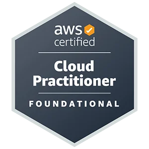

<h1><bold> AWS-Cloud-Practitioner <bold></h1>

AWS Certified Cloud Practitioner is a good starting point for individuals embarking on their journey to the cloud.

 
<h2><bold> AWS CLOUD PRACTITIONER (CLF-C02)</Bold></h2>
 

     

 

 CLF-CO2 is the updated version of CLF-C01. It was introduced on september 19, 2023. 

 
<h2> NEW EXAM DOMAIN </h2>
<ul>
  <li> Domain 1: Cloud Concepts 24% </li>
  <li> Domain 2: Security and Compliance 30% </li>
  <li> Domain 3: Cloud Technology and Services 34% </li>
  <li> Domain 4: Billing, Pricing, and Support 12% </li>
</ul>

 
<h3> The below Pictures shows the deatil differences between CLF-C01 and CLF-C02 exams domain and question weights. </h3>

    

 
<h4> NOTE </h4>

 In CLF-C02 exams  
     <ul>
        <li> Domain 1: Cloud Concepts -> Decreased by 2% </li>
        <li>Domain 2: Security and Compliance -> Increase by 5%</li>
         <li>Domain 3: Cloud Technology and Services -> Increase by 1%</li>
          <li>Domain 4: Billing, Pricing, and Support-> Decrease by 4%</li>
</ul>
 

<h2><strong> Domain 1: Cloud Concepts </srong></h2>
<ol?> 
  <li>1.1&nbsp;&nbsp;Define Benefits of the AWS Cloud</li>
  <li>1.2&nbsp;&nbsp;Identify Design Principles</li>
  <li>1.3&nbsp;&nbsp;Migration Benefits and Strategies</li>
   <li>1.4&nbsp;&nbsp;Cloud Economics Concepts</li>
</ol>
 

<h2><strong> Domain 2: Security and Compliance </srong></h2>
<ol>
  <li>2.1 &nbsp;&nbsp; Understand the AWS Shared Responsibility model. </li>
  <li>2.2 &nbsp;&nbsp; Understand AWS Cloud Security, Governance, and Complince Concepts.</li>
  <li>2.3 &nbsp;&nbsp; Identify AWS Access Management Capabilities.</li>
  <li>2.4 &nbsp;&nbsp; Identify Components and Resources for Security</li>
</ol>

 

<h2><strong> Domain 3: Cloud Technology and Services</srong></h2>

<ol>
  <li>3.1 &nbsp;&nbsp; Define methods of deploying and operating in the AWS Cloud.</li>
  <li>3.2 &nbsp;&nbsp; Define the AWS global infrastructure. </li>
  <li>3.3 &nbsp;&nbsp; Identify AWS compute services.</li>
  <li>3.4 &nbsp;&nbsp; Identify AWS database services.</li>
  <li>3.5 &nbsp;&nbsp; Identify AWS network services.</li>
  <li>3.6 &nbsp;&nbsp; Identify AWS storage services.</li>
  <li>3.7 &nbsp;&nbsp;  Identify AWS artificial intelligence and machine learning (AI/ML)
services and analytics services. </li>
  <li>3.8 &nbsp;&nbsp; Identify services from other in-scope AWS service categories. </li>
</ol>

 
 <h2><strong> Domain 4: Billing, Pricing, and Support </srong></h2>

 <ol>
    <li>4.1 &nbsp;&nbsp; Compare AWS pricing models.</li>
    <li>4.2 &nbsp;&nbsp; : Understand resources for billing, budget, and cost management.</li>
    <li>4.3 &nbsp;&nbsp;  Identify AWS technical resources and AWS Support options.</li>
</ol>
